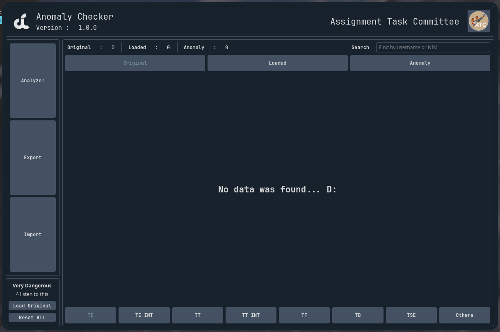

# Anomaly Detector

> [!NOTE]  
> This application is in quite heavy development, feel free
> to contribute to the project :>

Basically an application to check the anomalous grade to make
the work of Assignment Task Committee (ATC) easier.



## Run instruction

Basically just run this command

```sh
git clone https://github.com/petorikooru/Daskom-Anomaly-Detector
cd Daskom-Anomaly-Detector/src
```

```sh
python -m venv .venv
source .venv/bin/activate # (idk on windows though)
pip install -r requirement.txt
```

```sh
python main.py
```
